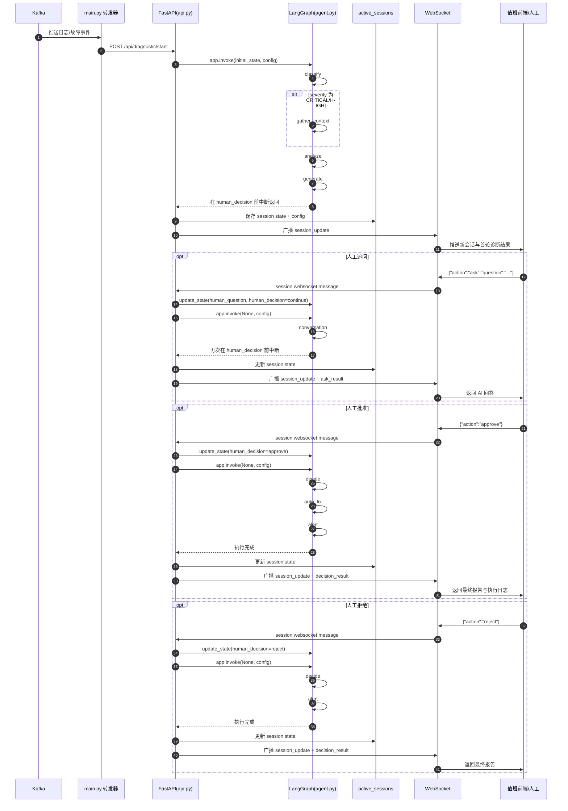
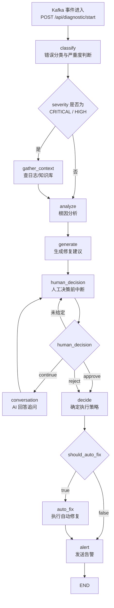

# AI DevOps 项目时序图与节点流转图

## 1. 整体时序图



## 2. 工作流节点流转图



## 3. 运行逻辑说明

- Kafka 不直接连 WebSocket。
- Kafka 只把事件交给 `main.py` 转发器。
- 转发器只负责 HTTP 调用 API。
- 真正执行 Agent 节点的是 `api.py` 对 `agent.py` 中 LangGraph 的调用。
- WebSocket 的职责是把 API 中的会话状态实时推送给前端，以及接收人工追问/审批指令。

## 4. 两条核心路径

### 4.1 首轮自动诊断

```text
Kafka -> main.py -> /api/diagnostic/start -> classify -> gather_context/analyze -> generate -> 中断等待人工
```

### 4.2 人工追问或审批

```text
前端 WebSocket -> api.py update_state -> LangGraph 从 human_decision 断点恢复 -> conversation 或 decide -> 后续节点
```

## 5. 文件对应关系

- `main.py`
  Kafka 消费与 HTTP 转发
- `api.py`
  REST/WebSocket 接口、会话状态管理、恢复工作流执行
- `agent.py`
  LangGraph 节点定义与节点路由
- `frontend/index.html`
  值班台页面，左侧会话列表，右侧实时问答
